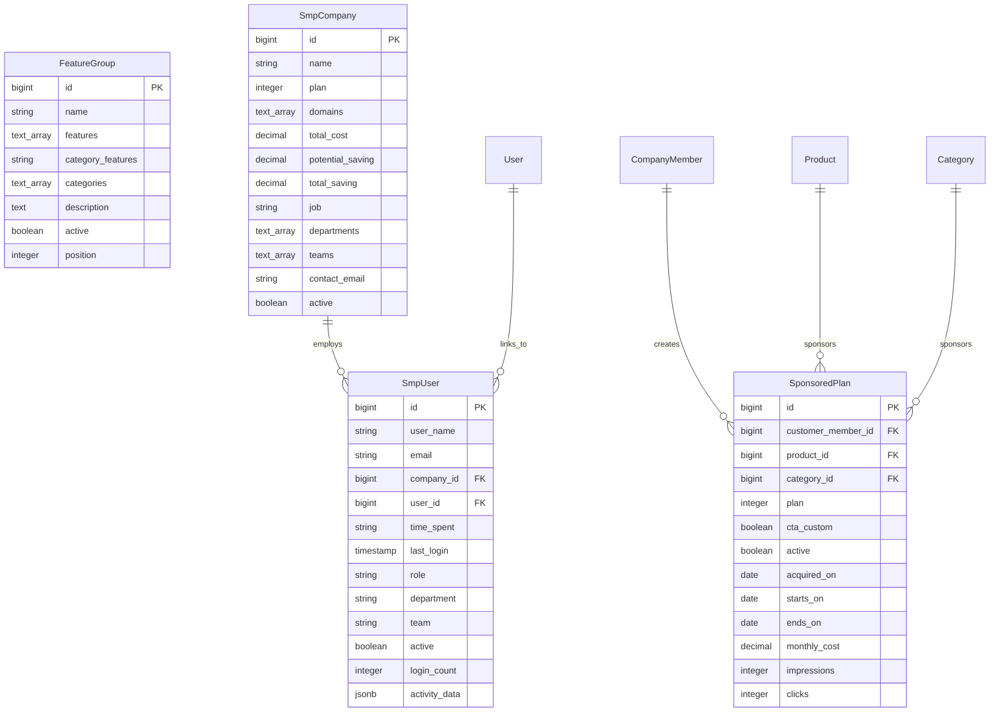

# Missing Models Implementation - Design Document

## Overview

This design document outlines the implementation of four critical missing models for the Solar Finder platform: FeatureGroup, SponsoredPlan, SmpCompany, and SmpUser. The design follows established Rails conventions and integrates seamlessly with the existing codebase architecture.

## Architecture

### Design Principles

1. **Consistency**: Follow existing model patterns and naming conventions
2. **Performance**: Optimize for common query patterns with proper indexing
3. **Scalability**: Design for growth with efficient data structures
4. **Maintainability**: Clear separation of concerns and readable code
5. **Integration**: Seamless integration with existing ActiveAdmin and Pundit systems

### Technology Stack Integration

- **Rails 7.0.6**: Leveraging modern Rails features and conventions
- **PostgreSQL**: Using array fields and GIN indexes for optimal performance
- **ActiveAdmin**: Consistent admin interface patterns
- **Pundit**: Role-based authorization following existing patterns
- **Sidekiq**: Background job processing for analytics and notifications

## Components and Interfaces

### 1. FeatureGroup Model

#### Purpose
Organize product features into logical groups for better user experience and product categorization.

#### Database Design
```sql
CREATE TABLE feature_groups (
  id BIGSERIAL PRIMARY KEY,
  name VARCHAR NOT NULL UNIQUE,
  features TEXT[] DEFAULT '{}',
  category_features TEXT,
  categories TEXT[] DEFAULT '{}',
  description TEXT,
  active BOOLEAN DEFAULT true,
  position INTEGER DEFAULT 0,
  created_at TIMESTAMP NOT NULL,
  updated_at TIMESTAMP NOT NULL
);

CREATE INDEX index_feature_groups_on_name ON feature_groups (name);
CREATE INDEX index_feature_groups_on_categories ON feature_groups USING gin (categories);
CREATE INDEX index_feature_groups_on_features ON feature_groups USING gin (features);
CREATE INDEX index_feature_groups_on_position ON feature_groups (position);
```

#### Model Architecture
```ruby
class FeatureGroup < ApplicationRecord
  # Validations following existing patterns
  validates :name, presence: true, uniqueness: true
  validates :position, presence: true, numericality: { greater_than_or_equal_to: 0 }
  
  # Scopes for common queries
  scope :active, -> { where(active: true) }
  scope :ordered, -> { order(:position, :name) }
  scope :by_category, ->(category) { where('? = ANY(categories)', category) }
  
  # Array manipulation methods following Provider model pattern
  def add_feature(feature)
    return if features.include?(feature)
    self.features = features + [feature]
    save
  end
  
  def remove_feature(feature)
    self.features = features - [feature]
    save
  end
end
```

#### Admin Interface
Following the established ActiveAdmin pattern with proper filtering and form inputs for array fields.

### 2. SponsoredPlan Model

#### Purpose
Manage premium advertising plans for providers with comprehensive analytics tracking.

#### Database Design
```sql
CREATE TABLE sponsored_plans (
  id BIGSERIAL PRIMARY KEY,
  customer_member_id BIGINT NOT NULL REFERENCES company_members(id),
  product_id BIGINT REFERENCES products(id),
  category_id BIGINT REFERENCES categories(id),
  plan INTEGER NOT NULL, -- enum: bronze=0, prata=1, ouro=2
  cta_custom BOOLEAN DEFAULT false,
  active BOOLEAN DEFAULT true,
  acquired_on DATE,
  starts_on DATE,
  ends_on DATE,
  monthly_cost DECIMAL(10,2),
  impressions INTEGER DEFAULT 0,
  clicks INTEGER DEFAULT 0,
  custom_cta_text TEXT,
  custom_cta_url VARCHAR,
  created_at TIMESTAMP NOT NULL,
  updated_at TIMESTAMP NOT NULL
);

CREATE INDEX index_sponsored_plans_on_customer_member_product ON sponsored_plans (customer_member_id, product_id);
CREATE INDEX index_sponsored_plans_on_plan ON sponsored_plans (plan);
CREATE INDEX index_sponsored_plans_on_dates ON sponsored_plans (starts_on, ends_on);
CREATE INDEX index_sponsored_plans_on_active ON sponsored_plans (active);
```

#### Model Architecture
```ruby
class SponsoredPlan < ApplicationRecord
  # Enums following existing pattern
  enum plan: { bronze: 0, prata: 1, ouro: 2 }
  
  # Associations
  belongs_to :customer_member, class_name: 'CompanyMember'
  belongs_to :product, optional: true
  belongs_to :category, optional: true
  
  # Validations
  validates :plan, presence: true
  validates :monthly_cost, presence: true, numericality: { greater_than: 0 }
  validate :end_date_after_start_date
  validate :product_or_category_present
  
  # Scopes for common queries
  scope :active, -> { where(active: true) }
  scope :current, -> { where('starts_on <= ? AND ends_on >= ?', Date.current, Date.current) }
  scope :expired, -> { where('ends_on < ?', Date.current) }
  
  # Business logic methods
  def current?
    starts_on <= Date.current && ends_on >= Date.current
  end
  
  def click_through_rate
    return 0 if impressions.zero?
    (clicks.to_f / impressions * 100).round(2)
  end
end
```

### 3. SmpCompany Model

#### Purpose
Enterprise solar management platform with multi-tenant capabilities and subscription management.

#### Database Design
```sql
CREATE TABLE smp_companies (
  id BIGSERIAL PRIMARY KEY,
  name VARCHAR NOT NULL UNIQUE,
  plan INTEGER NOT NULL, -- enum: free=0, pro=1, enterprise=2
  domains TEXT[] DEFAULT '{}',
  total_cost DECIMAL(12,2) DEFAULT 0,
  potential_saving DECIMAL(12,2) DEFAULT 0,
  total_saving DECIMAL(12,2) DEFAULT 0,
  job VARCHAR,
  departments TEXT[] DEFAULT '{}',
  teams TEXT[] DEFAULT '{}',
  contact_email VARCHAR NOT NULL,
  contact_phone VARCHAR,
  address TEXT,
  country VARCHAR DEFAULT 'Brazil',
  employees_count INTEGER DEFAULT 0,
  active BOOLEAN DEFAULT true,
  subscription_starts_on DATE,
  subscription_ends_on DATE,
  created_at TIMESTAMP NOT NULL,
  updated_at TIMESTAMP NOT NULL
);

CREATE INDEX index_smp_companies_on_name ON smp_companies (name);
CREATE INDEX index_smp_companies_on_plan ON smp_companies (plan);
CREATE INDEX index_smp_companies_on_domains ON smp_companies USING gin (domains);
CREATE INDEX index_smp_companies_on_active ON smp_companies (active);
CREATE INDEX index_smp_companies_on_subscription_dates ON smp_companies (subscription_starts_on, subscription_ends_on);
```

#### Model Architecture
```ruby
class SmpCompany < ApplicationRecord
  # Enums
  enum plan: { free: 0, pro: 1, enterprise: 2 }
  
  # Associations
  has_many :smp_users, dependent: :destroy
  
  # Validations
  validates :name, presence: true, uniqueness: true
  validates :plan, presence: true
  validates :contact_email, presence: true, format: { with: URI::MailTo::EMAIL_REGEXP }
  validates :employees_count, numericality: { greater_than_or_equal_to: 0 }
  
  # Scopes
  scope :active, -> { where(active: true) }
  scope :subscription_active, -> { where('subscription_ends_on >= ?', Date.current) }
  
  # Business logic methods
  def subscription_active?
    subscription_ends_on.present? && subscription_ends_on >= Date.current
  end
  
  def savings_percentage
    return 0 if total_cost.zero?
    (total_saving / total_cost * 100).round(2)
  end
end
```

### 4. SmpUser Model

#### Purpose
Track enterprise user activity and manage organizational structure within SMP companies.

#### Database Design
```sql
CREATE TABLE smp_users (
  id BIGSERIAL PRIMARY KEY,
  user_name VARCHAR NOT NULL,
  email VARCHAR NOT NULL,
  company_id BIGINT NOT NULL REFERENCES smp_companies(id),
  user_id BIGINT REFERENCES users(id),
  time_spent VARCHAR,
  last_login TIMESTAMP,
  role VARCHAR DEFAULT 'member',
  department VARCHAR,
  team VARCHAR,
  active BOOLEAN DEFAULT true,
  login_count INTEGER DEFAULT 0,
  activity_data JSONB,
  timezone VARCHAR DEFAULT 'America/Sao_Paulo',
  created_at TIMESTAMP NOT NULL,
  updated_at TIMESTAMP NOT NULL
);

CREATE UNIQUE INDEX index_smp_users_on_company_email ON smp_users (company_id, email);
CREATE INDEX index_smp_users_on_user_name ON smp_users (user_name);
CREATE INDEX index_smp_users_on_last_login ON smp_users (last_login);
CREATE INDEX index_smp_users_on_active ON smp_users (active);
CREATE INDEX index_smp_users_on_activity_data ON smp_users USING gin (activity_data);
```

## Data Models

### Entity Relationships



### Data Validation Rules

1. **FeatureGroup**: Name uniqueness, position non-negative, array fields properly formatted
2. **SponsoredPlan**: Date validation, cost positivity, either product or category required
3. **SmpCompany**: Email format validation, unique company names, subscription date logic
4. **SmpUser**: Email uniqueness within company, proper timezone format, activity data structure

## Error Handling

### Validation Errors
- Clear, user-friendly error messages following Rails i18n patterns
- Proper field-level validation with specific error types
- Custom validation methods for complex business rules

### Database Constraints
- Foreign key constraints with proper cascade behavior
- Unique constraints with meaningful error messages
- Check constraints for enum values and business rules

### Exception Handling
```ruby
# Custom exception classes
class SponsoredPlanError < StandardError; end
class SmpCompanyError < StandardError; end

# Graceful error handling in controllers
rescue_from SponsoredPlanError, with: :handle_sponsored_plan_error
```

## Testing Strategy

### Unit Tests
- Model validations and associations
- Business logic methods
- Enum functionality
- Scope queries
- Array manipulation methods

### Integration Tests
- Admin interface functionality
- Model interactions
- Data integrity across associations
- Performance with large datasets

### Test Data Factory
```ruby
# FactoryBot patterns following existing conventions
FactoryBot.define do
  factory :feature_group do
    name { Faker::Commerce.department }
    features { [Faker::Commerce.product_name, Faker::Commerce.product_name] }
    categories { ['solar', 'energy'] }
    active { true }
    position { rand(1..10) }
  end
end
```

## Performance Considerations

### Database Optimization
- **GIN Indexes**: For array field queries (features, categories, domains)
- **Composite Indexes**: For common query patterns (company_id + email)
- **Partial Indexes**: For active records and current subscriptions

### Query Optimization
- **Eager Loading**: Prevent N+1 queries with proper includes
- **Scoped Queries**: Efficient filtering with database-level operations
- **Pagination**: For large result sets in admin interfaces

### Caching Strategy
- **Fragment Caching**: For expensive calculations (savings percentage, CTR)
- **Query Caching**: For frequently accessed reference data
- **Counter Caches**: For association counts where appropriate

## Security Considerations

### Authorization
- **Pundit Policies**: Following existing authorization patterns
- **Company-Level Isolation**: SMP users can only access their company data
- **Role-Based Access**: Different permissions for different user roles

### Data Protection
- **Sensitive Data**: Proper handling of financial information
- **Audit Trails**: Logging of important operations
- **Input Sanitization**: Protection against injection attacks

## Migration Strategy

### Development Environment
1. Create migrations in dependency order
2. Run migrations with proper rollback testing
3. Seed with comprehensive test data
4. Verify admin interfaces and associations

### Production Deployment
1. **Backup Strategy**: Full database backup before migration
2. **Maintenance Mode**: Brief downtime for complex migrations
3. **Rollback Plan**: Tested rollback procedures for each migration
4. **Monitoring**: Post-deployment performance monitoring

## Integration Points

### Existing Models
- **CompanyMember**: Links to SponsoredPlan for advertising management
- **Product/Category**: Referenced by SponsoredPlan for targeted advertising
- **User**: Optional link from SmpUser for unified user management

### Admin Interface
- **Consistent Styling**: Following existing ActiveAdmin patterns
- **Proper Filtering**: Search and filter capabilities for all models
- **Bulk Operations**: Where appropriate for administrative efficiency

### Background Jobs
- **Analytics Processing**: Sidekiq jobs for impression/click tracking
- **Subscription Monitoring**: Automated checks for expiring subscriptions
- **Activity Aggregation**: Periodic rollup of user activity data

This design provides a solid foundation for implementing the missing models while maintaining consistency with the existing codebase and ensuring scalability for future growth. 